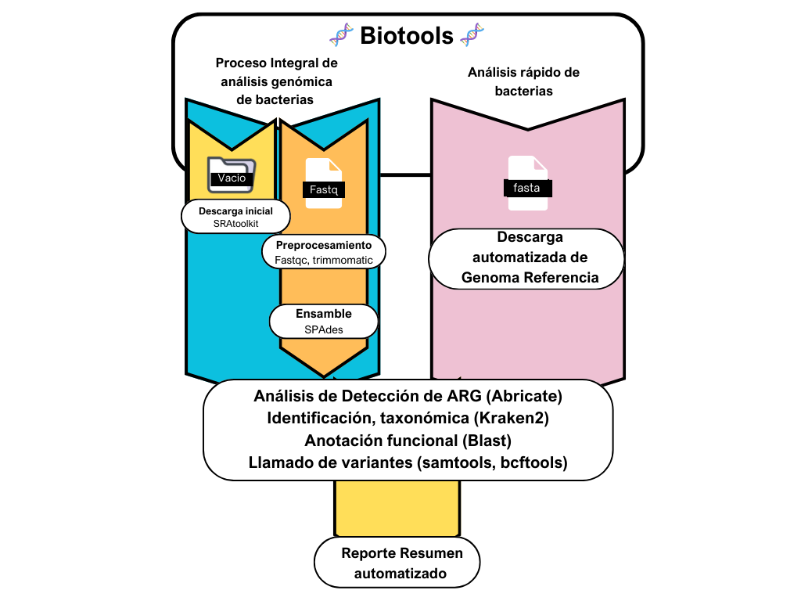

# 🧬 Biotools 🧬
[](https://github.com/BnjmStd/BnjmnProyectMemory)


# Introducción

En respuesta a la creciente nececidad de simplificar el análisis de bacterias, se ha desarrollado un pipeline en NextFlow. Este facilita el análisis de resistencia antibióticos (ARG), llamada de variantes, identificación taxonomica y anotación funcional de bacterias noveles. El objetivo principal de este pipeline es proporcionar a los investigadores, incluso aquellos con conocimiento limitados en bioinformática, una herramienta accesible para explorar bacterias. 

El pipeline incluye la automatización de etapas claves como el procesamiento de datos crudos, como herramientas como trimmomatic, fastqc, el ensamblaje de genomas bacterianos utilizando SPAdes para un posterior análisis. Además, se ha diseñado un reporte completo que presenta de manera clara y concisa los resultados obtenidos, lo que permite una fácil interpretación.



# Instalación y Configuración
### Uso:

1. Clona este repositorio

2. Instalar Docker Desktop

    Antes de usar este proyecto, asegúrate de tener Docker Desktop instalado en tu sistema. Puedes encontrar instrucciones detalladas sobre cómo instalar Docker Desktop en la documentación oficial de Docker: https://docs.docker.com/

3. Generar la imagen

    Para generar la imagen se recomienda el comando
    `
    docker-compose -f docker-compose.yml up --build 
    `
    
> [!WARNING]
> La imagen de Docker utilizada para construir el contenedor puede tener un tamaño más elevado de lo normal, lo que puede resultar en un tiempo de construcción prolongado. Estamos trabajando en optimizar esta imagen para reducir su tamaño y mejorar la eficiencia del proceso de construcción. Agradecemos tu paciencia mientras trabajamos en esta mejora.

> [!WARNING]
> Ten en cuenta que la imagen de Docker generada puede ocupar más espacio en disco de lo esperado. 

4. Ejecutar el contenedor

    Para ejecutar el contendor:
    `docker-compose docker-compose.yml run pipeline /bin/bash
    `

5. Antes de ejecutar el pipeline 

> [!IMPORTANT]
> Configurar el archivo [nextflow.config](./nextflow.config) con la cantidad de CPUS y MEMORY acorde a tus intereses.

> [!NOTE] 
> Si desea realizar la descarga de fastq a través del pípeline utilizando SRAtoolkit ejecute ``


En el caso de realizar un análisis de identificación taxonómica, es necesario la descarga previa de la base de datos de la web oficial de kraken2 https://benlangmead.github.io/aws-indexes/k2

> [!TIP]
> Si no desea descargar la base de datos manualmente, existe la funcionalidad de realizarla a través del pipeline con el comando --dbdownload [nombredeladb]. Los nombres de la base de datos disponibles para descargar se encuentran en [Nombres de bases de datos](./misc/dbnames.txt)

> [!CAUTION]
> Se debe escribir tal cual se encuentran las colecciones dentro del archivo en la ejecución del pipeline.

# Instrucciones de Uso:

Para comenzar a usar el pipeline, es esencial tener un directorio disponible. Puede ser un directorio vacío o uno que contenga archivos FastQ.

> [!IMPORTANT]
> Si no planea trabajar con archivos FastQ y, por ende, no realizará limpieza de lecturas ni ensamblaje, se recomienda no utilizar el parámetro --path --> Use --f

Si el directorio está vacío y deseas comenzar a descargar archivos FastQ para un análisis posterior, puedes usar el siguiente comando:

```bash
    nextflow run script.nf --path [directorio vacio ] \
    --id_sra [SRRXXXXX] \
    --x  1000 
```

Por defecto, se descargarán 1000 lecturas, pero puedes cambiar este número utilizando el parámetro `--x`.

Además, si la librería tiene el formato Layout: PAIRED, puedes usar `--paired` para descargar el par de archivos FastQ correspondientes.

> [!WARNING]
> Recuerde que para descargar se debe disponer de un ID SRR.

## Preprocesamiento

Dentro del pipeline se puede utilizar FastQC y trimmomatic para poder procesar las lecturas.

Para ejecutar FastQC, utiliza el siguiente comando:

```bash
nextflow run script.nf --path [directorio] \
    --fastqc
```

> [!CAUTION]
> Por el momento, no se encuentra necesario mezlcar el parámetro `--fastqc` con los demás por ende no se admiten más parámetros usando FastQC.

Para ejecutar Trimmomatic se dispone de varios parámetros con sus valores por defecto:

- `--trimmo`: PE | SE
- `--threads`: número de threads disponibles.
- `--phreads`: phred33 | phred64
- `--illuminaAdapter`: "TruSeq3-PE-2.fa", "TruSeq3-PE.fa", "TruSeq2-PE.fa", "NexteraPE-PE.fa", "TruSeq3-SE.fa", "NexteraPE-PE.fa"
- `--leading`
- `--trailing`
- `--slidingwindow`
- `--minlen`

Ejemplos de ejecución:

```bash
nextflow run script.nf --path [directorio] \
    --trimmo pe \
    --threads 2 \
    --leading 3 \
    --trailing 3 \
    --slidingwindow 4:15 \
    --minlen 36
```

>[!IMPORTANT]
> A diferencia de FastQC, Trimmomatic puede combinarse con otros parámetros. Esto significa que los resultados de Trimmomatic pueden alimentar directamente a SPAdes para su posterior análisis.

## Ensamble

Para realizar el ensamble de novo dentro del pipeline hay varios caminos:

- Preprocesamiento y ensamble: 

Se puede usar el parámetro `--trimmo` & `--spades`, ejemplo de uso:

```bash
    nextflow run script.nf --path [directorio] \
        --trimmo pe \
        --threads 2 \
        --leading 3 \        
        --trailing 3 \        
        --slidingwindow 4:15 \        
        --minlen 36 \
        --spades

```

## Análisis

> [!TIP]
> Se puede usar `--trimmo` `--spades` para alimentar uno o varios análisis

### Identificación taxonómica

Para la identificación Taxonómica se utiliza Kraken2, hay varias maneras de lograr generar el análisis:

Ejecutar kraken2 junto a un preprocesamiento y ensamble:

```bash
    nextflow run script.nf --path [directorio] \
        --trimmo pe \
        --threads 2 \
        --leading 3 \        
        --trailing 3 \        
        --slidingwindow 4:15 \        
        --minlen 36 \
        --spades \
        --kraken \
        --db [ruta de la base de datos]
```
> [!WARNING]
> Se recomienda usar una ruta para la base de datos absoluta. Ejecute `$pwd` para conocerla.

- Ejecutar kraken2 a través de un fasta:

```bash
    nextflow run script.nf --f [archivo fasta] \
        --kraken \
        --db [ruta de la base de datos]
```

> [!NOTE] 
> Recuerda que se puede descargar la base de datos que usted desee a través del comando `--dbdownload`

### Identificación de ARG 

Para realizar la identificación de genes de resistencia antibióticos se utiliza AMRFinder.

- Para ejecutar AMRFinder junto a un preprocesamiento y ensamble: 

```bash
    nextflow run script.nf --path [directorio] \
        --trimmo pe \
        --threads 2 \
        --leading 3 \        
        --trailing 3 \        
        --slidingwindow 4:15 \        
        --minlen 36 \
        --spades \  
        --amrFinder \
        --organism Acinetobacter_baumannii \
        --type p
```
> [!WARNING]
> El `--organism` es opcional, se suele utilizar para una mayor eficacia.

Para el parámetro `organism` se aceptan las siguientes opciones:

- "Acinetobacter_baumannii"
- "Burkholderia_cepacia"
- "Burkholderia_pseudomallei"
- "Campylobacter"
- "Citrobacter_freundii"
- "Clostridioides_difficile"
- "Enterobacter_asburiae"
- "Enterobacter_cloacae"
- "Enterococcus_faecalis"
- "Enterococcus_faecium"
- "Escherichia"
- "Klebsiella_oxytoca"
- "Klebsiella_pneumoniae"
- "Neisseria_gonorrhoeae"
- "Neisseria_meningitidis"
- "Pseudomonas_aeruginosa"
- "Salmonella"
- "Serratia_marcescens"
- "Staphylococcus_aureus"
- "Staphylococcus_pseudintermedius"
- "Streptococcus_agalactiae"
- "Streptococcus_pneumoniae"
- "Streptococcus_pyogenes"
- "Vibrio_cholerae"
- "Vibrio_parahaemolyticus"
- "Vibrio_vulnificus"

Para el parámetro `type`, se aceptan las siguientes opciones:

- n: normal
- p: pathogenic

Ejemplo de ejecución de AMRFinder a través de un archivo Fasta:

```bash
nextflow run script.nf --f [archivo fasta] \
    --amrFinder \
    --organism Acinetobacter_baumannii \
    --type p
```

### Llamado de variantes

### Anotación funcional

## Reporte

# Configuración Avanzada:
## Detalles sobre cómo personalizar la configuración del pipeline.
## Explicación de cómo modificar parámetros, cambiar flujos de trabajo o agregar nuevas funcionalidades.
# Dependencias y Requisitos:

La lista de todas las dependencias y requisitos de software.

[Nombre del archivo](ruta/del/archivo)

<details>
<summary>Click para ver los detalles</summary>

Aquí puedes escribir el contenido que deseas mostrar cuando se haga clic en "Ver detalles".

Puedes incluir cualquier texto, listas, imágenes u otros elementos de Markdown aquí.

</details>


## Detalles sobre las versiones específicas de las herramientas utilizadas.
# Solución de Problemas:
## Sección que aborda problemas comunes y sus soluciones.
## Preguntas frecuentes y posibles errores durante la ejecución.
# Contribuciones y Colaboración:
## Instrucciones para contribuir al desarrollo del pipeline.
## Detalles sobre cómo informar errores, enviar solicitudes de extracción, etc.
# Referencias y Recursos Adicionales:
# Licencia:
## Declaración de la licencia del pipeline y cualquier software de terceros utilizado.

## Parámetro 

## Estructura del proyecto

## Contribuir

## Licencia 

 nextflow run script.nf --path misc/mocks/ --trimmo pe --threads 2 --leading 3 --slidingwindow4:15 --minlen 36 --trailing 3 --iluminaAdapter TruSeq3-PE.fa:2:30:10 --spades --variantCall --variantRef misc/ref/GCA_000005845.2_ASM584v2_genomic.fna --taxonomy --db /workspace/misc/db/db/ --annotation --arg --type n 